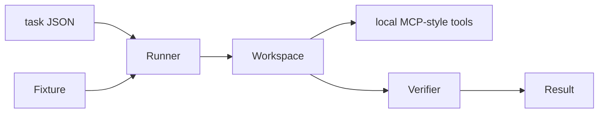

# MCP RL Environment Lab

Deterministic software-engineering tasks for evaluating coding agents that must discover local state through MCP-style tools. It demonstrates Python, TypeScript task design, tool isolation, verification, and golden-reference thinking.

## Overview

Eight seeded fixtures cover bug fixing, feature work, refactoring, and performance analysis across Python and TypeScript. A task reset copies a known starting state; verification is deterministic and gives a clear pass/fail score.

## Architecture



See [docs/architecture.md](docs/architecture.md) for isolation and verification decisions.

## Getting started

```bash
python -m pip install pytest ruff
PYTHONPATH=src python run_task.py --list
PYTHONPATH=src python run_task.py task_001 --workspace .task-workspace
PYTHONPATH=src python run_task.py task_001 --verify --workspace .task-workspace
PYTHONPATH=src python -m pytest
ruff check .
```

## Engineering decisions

- Fixtures are local and seeded; no live service can change a result.
- Tool paths are constrained to the active workspace.
- Golden solutions are explanatory references, distinct from candidate output.

## Limitations and next steps

This intentionally uses a compact observable rather than executing arbitrary untrusted code. A production version would add process sandboxing, trace capture, and a real MCP transport.

## Skills demonstrated

Python, TypeScript-oriented task design, Model Context Protocol concepts, agent evaluation, deterministic verification, testing, and technical documentation.
